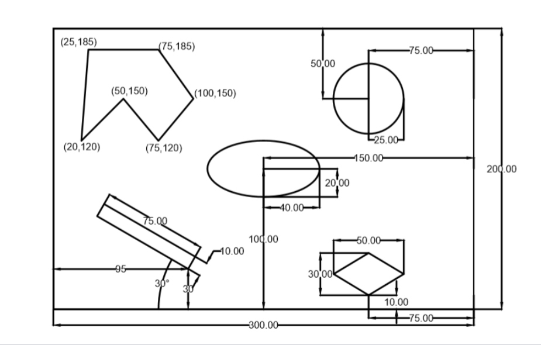
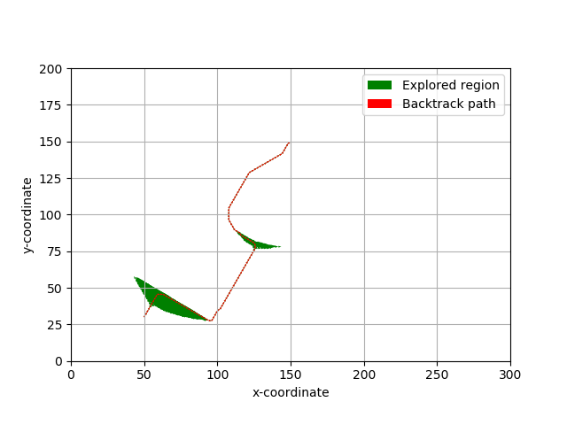

# Path Planning using A-star Algorithm

[](LICENSE.md)
---


### Author
Arpit Aggarwal Shantam Bajpai


### Instructions for running the code
To run the code for finding the path, follow the following commands:

```
cd codes
python Astar_rigid.py
```


### Obstacle Map



### Results
The following is an example of A-star algorithm applied on a rigid robot (Start Node- (50, 30, 60), Goal Node- (150, 150), Radius- 1, Clearance- 1, Step Size- 1):



### Software Required
To run the .py files, use Python 3. Standard Python 3 libraries like numpy, heapq and matplotlib are used.
